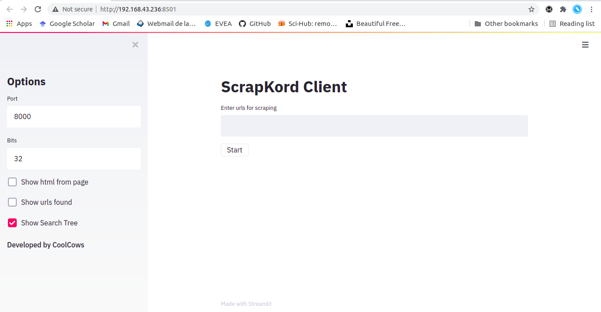
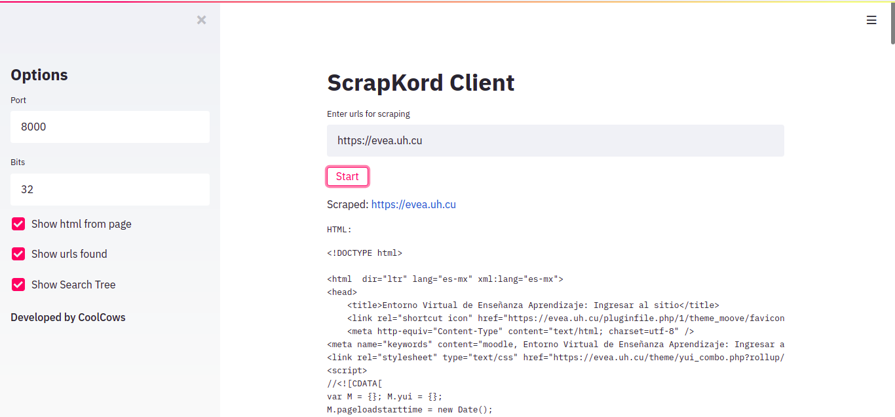
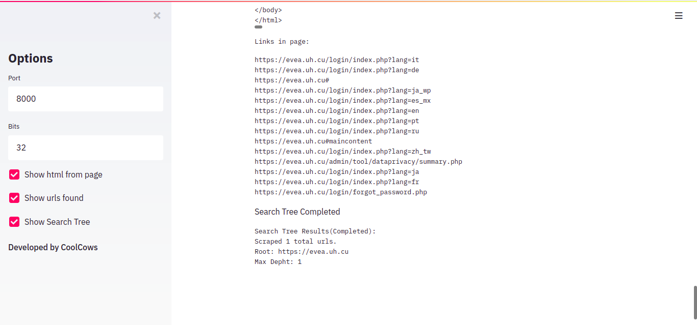

# Distributed-Scrapper
**Autores**: Rodrigo Pino, Adrián Rodríguez Portales, C-412

## ScrapKord

**ScrapKord** es un sistema de *web-scraping* distribuido basado en *Chord*. Está compuesto por 3 tipos de nodos: un nodo *chord* , un nodo *scraper* y un nodo cliente. El sistema es descentralizado y siempre que exista algún nodo de cada tipo es posible responder pedidos. Dado que una menor cantidad de nodos implica menor rendimiento, **ScrapKord**  permite la entrada de nuevos nodos en pleno funcionamiento. Además, el sistema es tolerante a fallas y después de la caída o entrada de nodos siempre se logra estabilizar.

### pychord

En este módulo se encuentra una implementación del DHT Chord. Además de las funcionalidades propias de los nodos Chord, cuenta con un sistema de replicación para poder conservar las llaves de un nodo en caso de fallos. Posee operaciones básicas de un sistema de este tipo como *find_successor* y el manejo de las llaves, desde búsqueda e inserción hasta eliminación. La implementación brinda todas estas funciones en forma de RPCs.   

### scraper_chord

En este módulo se encuentran las implementaciones de dos de los tipos de nodos del sistema de **ScrapKord**:

* nodo *chord*: Un nodo de este tipo es una especialización de la clase `ChordNode` de `pychord`, implementada explicítamente para utilizar los servicio de un scraper. Este nodo posee dos conjuntos de funciones principales:

    * Comunicación con los clientes: Se encarga de las comunicaciones con los clientes. Este toma todos los pedidos que le hagan los clientes y busca los mismos en la caché antes de pasarlos al scraper.

    * Comunicación con los scrapers: Se encarga de buscar scrapers y enviarles los pedidos de los clientes en caso de que no estén en la caché. Recibe los resultados de los scrapers para guardarlos en la caché y luego enviarlos al usuario.

* nodo cliente: Un nodo de este tipo es el encargado de recibir como entrada los pedidos del usuario para enviarlos al nodo *chord* que debe procesarlos, y luego esperar la respuesta. En el caso de pedidos de profundidad mayor que uno, se encarga que gestionar el árbol de búsqueda.
### scraper

En este módulo se encuentra el último tipo de nodo y quien hace el trabajo realmente de procesar el pedido del usuario: ofrece el servicio de scrapear en la red. Un nodo le pide sus servicios y este responde si está disponible de acuerdo a la cantidad de trabajadores (*free working threads*) que tenga en ese momento. En el caso de responder afirmativamente, este crea un nuevo *worker* que se conecta a cierto puerto especificado por el *requester*. Una vez conectados, obtiene los trabajos a través del uso de pull, y cuando son finalizados empieza a hacerles push.

### Ejecución:
#### Nodo ScrapChord:

```bash
python run.py sc <port> <bits>
```
nota: `sc` puede ser sustituido por `chord` o `scrapchord`

* `<port>` puerto principal del nodo *chord*
* `<bits>` cantidad de *bits* con el que va a trabajar el nodo *chord* 

#### Nodo Scraper

```bash
python run.py s <port> <max_worker>
```
* `<port>` puerto principal del nodo *scraper*
* `<max_worker>` cantidad maxima de *worker* del nodo

#### Nodo Cliente

```bash
python run.py c <port> <bits>
```
* `<port>` puerto principal del nodo cliente
* `<bits>` cantidad de *bits* con el que trabajan los nodos *chord* a los cuales se va a conectar

#### Interfaz gráfica de Streamlit

Si se cuenta con `streamlit` se puede ejecutar un cliente con una interfaz gráfica simple e intuitiva

```bash
streamlit run st_client.py 
```






### Ejemplo

Se levantaron 9 nodos en total en el inicio: 3 nodos *scrapers* (**s1**, **s2**, **s3**), 3 nodos chords (**sc1**, **sc2**, **sc3**) y 3 nodos clientes (**c1**, **c2**, **c3**). **c1** pide como *request* scrapear www.uci.cu con profundidad 3, lo cual debe tomar bastante tiempo ya que son cerca de 3000 páginas. Luego de un tiempo **c2** hace el mismo pedido. En muy poco tiempo alcanza a **c1** debido a que las primeras páginas ya están guardadas en la caché de los nodos enrutadores *chords*. **c3** hace el *request* evea.uh.cu 3. Este también tomará un tiempo, porque no se había pedido antes y también se trata de un cantidad considerable de enlaces. Luego se cierran **c2** y **c3**. Se añade **sc4** a la red. Se cierra **s1** y disminuye la potencia de cómputo del sistema. Se vuelve a levantar **s1** y al rato comienza a recibir pedidos nuevamente, ya que los nodos *chords* buscan *scrapers* a cada rato o cuando tienen mucha carga de trabajo. Se tumbam los nodos *chord* poco a poco hasta dejar **sc4**. El cliente restante se cierra. Luego de abrir un nuevo cliente y pedir  www.uci.cu 3 nuevamente los resultados empiezan a llegar inmediatemene porque ya estaban en la caché de Chord y aunque no único nodo restante en la red no era quien originalmente estaba manejando esto pedidos, las llaves fueron pasadas a este (replicación), durante el procesamiento de los pedidos por parte de los otros.


