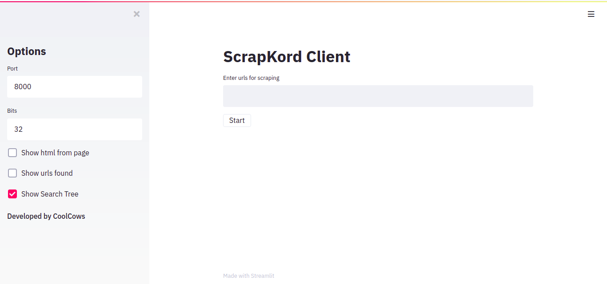

# Distributed-Scraper
**Autores**: Rodrigo Daniel Pino Trueba, Adrian Rodriguez Portales, C-412

## ScrapKord

**ScrapKord** es un sistema de *web-scraping* distribuido basado en *Chord*. Está compuesto por 3 tipos de nodos: un nodo *chord* , un nodo *scraper* y un nodo cliente. El sistema es descentralizado y siempre que exista algún nodo de cada tipo es posible responder pedidos. Debido a la estructura del sistema el rendimiento es proporcional a la cantidad de nodos presentes. **ScrapKord**  permite además la entrada y salida nodos durante su funcionamiento, manteniendo un dinamismo en la red. El sistema cuenta también con mecanismos que lo hacen tolerante a fallas; si se cae un nodo de cualquier tipo, el evento sera eventualmente reconocido por la red y dado un tiempo determinado se reorganizara de manera acorde.

### pychord

En este módulo se encuentra una implementación del DHT Chord. Además de las funcionalidades propias de los nodos Chord, cuenta con un sistema de replicación para poder conservar las llaves de un nodo en caso de fallos. Posee operaciones básicas de un sistema de este tipo como *find_successor* y el manejo de las llaves, desde búsqueda e inserción hasta eliminación. La implementación brinda todas estas funciones en forma de RPCs.   

### scraper_chord

En este módulo se encuentran las implementaciones de dos de los tipos de nodos del sistema de **ScrapKord**:

#### ScrapChord

El `ScrapChord` Consiste e una especialización de la clase `ChordNode` de `pychord`, implementada explicítamente para utilizar los servicio de un scraper. Este nodo posee dos funciones principales:

* Comunicación con los nodos clientes: Se encarga de las comunicaciones con los clientes. Este toma todos los pedidos que le hagan los clientes y busca los mismos en la caché antes de pasarlos al scraper.
* Comunicación con los scrapers: Una vez tenga pedidos pendiendentes (pedidos que no tiene almacenados) buscará scrapers en la red y le re-enviará los pedidos. Una vez obtenidods los resultados almacenara y devolvera los resultados al cliente. En caso de que el nodo tenga muchos pedidos pendientes buscará apoyo en otros scrapers aumentando su poder de cómputo. 

A nivel técnico, en el nodo _chord_ la comunicación con los scraper se divide en 2 hilos. Un hilo se encarga de que mientras hayan pedidos pendientes mantener una conexión contante con un scraper (o a varios). El otro es el que envia los pedidos en sí al _scraper_.

Este segundo hilo cuenta con 2 sockets ZMQ push y pull para realizar su función. Aúxiliandonos del socket _push_ que usa _round robing_ para repartir el trabajo entre sus _peers_ logramos una reparticion uniforme del trabajo entre los distintos scrapers conectados.

#### ScrapChordClient

El `ScrapChordClient` es el nodo cuya función es brindarle acceso al usurio a la red de nodos `ScrapChord` y `Scraper`. Recibe los pedidos del usuario a través de la entrada estándar y se los envía al  nodo _chord_ que él usuario "crea" que le toque el pedido, si el nodo chord no es el adecuado para responder a ese _request_ le responde al cliente con el nodo responsable para que este pueda repetir su pedido a dicho nodo.

En el caso de los pedidos de profundidad mayor que uno, el nodo cliente es el responsable de gestionar el árbol de búsqueda, la red de nodos  _chord_ y _scrapers_ es ajena al proceso. 

El `ScrapChordClient` cuenta además con una interfaz visual.

### scraper

En este módulo se encuentra la clase `Scraper`, cuya función es procesar el pedido de un usuario. Dado un _url_ obtiene el html de este, y los links que se mantienen dentro del dominio. Esta clase cuenta con el modelo _worker/dispatcher_ donde por cada nodo _chord_ que quiera utilizar sus servicio crea un _worker_ que se conecta a cierto puerto especificado por el _requester_.El nodo _scraper_ tiene un limíte de trabajadores disponibles (especifícados durante su inicialización) y una vez se encuentre lleno negará sus servicios hasta que uno de sus trabajadores termine.

El _worker_ a nivel técnico consiste en 2 socket de ZMQ, un _pull_ por donde reciben los pedidos a procesar, y un _push_ por donde se envían los resultados. Por cada _pull_ se procesa el _request_ y se realiza un _push_. Los pedidos que den error por _timeout_ o error de conección no son devueltos al cliente.

### Otros

Tanto los `ScrapChord` como los `Scraper` cuentan con un mecanismo de descubrimiento en la red. Se puede establecer cuando se ejecutan instancias de estas clases la cantidad de veces que pueden ser descubierto un nodo antes de ser visibles. De esta manera no siempre es necesario conocer la direccion de un nodo, se realiza un broadcast y se halla uno. En caso de que ese que encontro el uno, el uno el informe que ese es su ultimo broadcas el nodo se vuelve visible un timpo determinado. 

### Ejecución:
#### Nodo ScrapChord:

```bash
python run.py sc <port> <bits>
```
nota: `sc` puede ser sustituido por `chord` o `scrapchord`

* `<port>` puerto principal del nodo *chord*
* `<bits>` cantidad de *bits* con el que va a trabajar el nodo *chord* 

#### Nodo Scraper

```bash
python run.py s <port> <max_worker>
```
* `<port>` puerto principal del nodo *scraper*
* `<max_worker>` cantidad maxima de *worker* del nodo

#### Nodo Cliente

```bash
python run.py c <port> <bits>
```
* `<port>` puerto principal del nodo cliente
* `<bits>` cantidad de *bits* con el que trabajan los nodos *chord* a los cuales se va a conectar

#### Interfaz gráfica de Streamlit

Si se cuenta con `streamlit` se puede ejecutar un cliente con una interfaz gráfica simple e intuitiva

```bash
streamlit run st_client.py 
```



### Ejemplo

